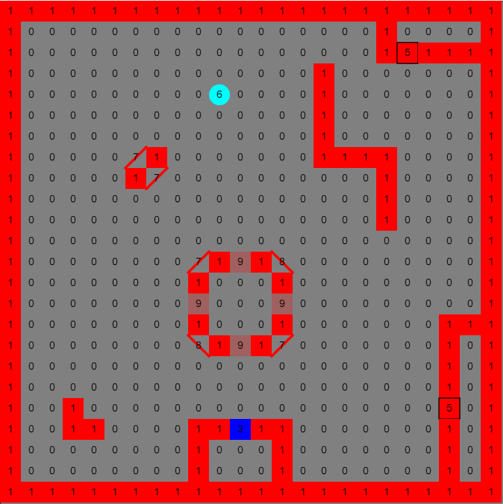
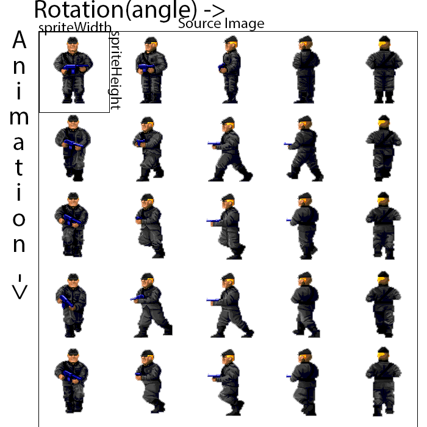

# p5.RayCaster
A simple library for p5.js to make semi-3D scene or game with ray casting. Made by [JohnC](https://johncheung.art)

Based on algorithms from [lodev](https://lodev.org/cgtutor/raycasting3.html) and the demo made by [Andrew Mushel](https://github.com/almushel/raycast-demo)

If you are not familiar with what ray casting is, read [lodev's blog](https://lodev.org/cgtutor/raycasting3.html) which explain it really well.

If you made anything interesting with this library, let me know!

# Installation

include `dist/p5.RayCaster.min.js` in your project
```html
...
<head>
    ...
    <script src="path/tp/p5.js">
    <script src="path/to/p5.RayCaster.min.js">
    <script src="sketch.js">
    ...
</head>
...
```
This will provide the `RayCaster` module.
# API
[click here](https://real-john-cheung.github.io/p5.RayCaster/api/)

# Example
* [basic](https://real-john-cheung.github.io/p5.RayCaster/example/basic/)
* ...

# How to use
## Basic concept
There are four basic component in p5.RayCaster library, `World`, `Camera`, and `Sprite`

### World
`World` class apis: [click here](https://real-john-cheung.github.io/p5.RayCaster/api/World.html)

`World` is the type of objects that store information about your scene. You can think about it as a game world, the major properties it has include `map`, `table`, `skyBok`, `textureMap`, `sprites`, and `cameras`.

To create a `World` object, use `RayCaster.createWorld()`

```js
RayCaster.createWorld(24,24); // return a World object with a width of 24 block and a height of 24 block with default properties
RayCaster.createWorld(width, height, mapData, textureMap, skyBox, typeTable, options); // return a World object with customized properties, see below sections for each of the items
```

#### table
`World.table` is an object storing information about different type of block in the world, by default it is:
```js
defaultTypeTable = {
    MAP_FLOOR: 0, // floor means no wall or other type of blocks
    MAP_WALL: 1, // wall 
    MAP_WALL_SHADOW: 2, // for rendering shadow overlay on wall, should not be used in map
    MAP_DOOR: 3, // door
    MAP_DOOR_FRAME: 4, // door frame or an open door
    MAP_PUSH_WALL: 5, // wall that can be destroyed, often used to create hidden room
    MAP_CIRCULAR_COLUMN: 6, // round pillar
    MAP_DIA_WALL_TR_BL: 7, // diagonal walls from top right to bottom left of the block
    MAP_DIA_WALL_TL_BR: 8, // diagonal walls from top left to bottom right of the block
    MAP_TRANSPARENT_WALL: 9, // transparent wall (ray can go past it)
    DOOR_CLOSED: 0, // for recoding door state
    DOOR_OPENING: 1, // for recoding door state
    DOOR_OPEN: 2, // for recoding door state
    DOOR_CLOSING: 3, // for recoding door state
}
```
It is highly recommended to design your map according to this default table instead of modifying it. However you can do that by passing your typeTable in `RayCaster.createWorld()`. `World.table` is used as an reference for `Camera.miniMapOptions`, so if you used a type table other then the default one you need to update the `Camera.miniMapOptions` too.

#### map
`World.map` is a flat array storing the type of each block in the world, referencing `World.table`. Each element of the array is a number representing the type of the block in the world.

You can load a map with `loadMap()` after creating a world or pass the map data in `RayCaster.createWorld()`.
```js
var world = RayCaster.createWorld(24,24);
world.loadMap(mapData);
```
`mapData` can be a string of number separated by comma, like `"1,1,1,1,1,0,..."`, a flat array of number `[1,1,1,1,1,0,...]` or a 2D array of number which will be more readable, for example:
```js
mapData = [
    [1,1,1,1,1,1],
    [1,0,0,0,0,1],
    [1,0,0,0,0,1],
    [1,1,1,1,1,1]
]
```
If `mapData` is a 2D array, the map defined by map data can be smaller or larger then the world's size, in which case the `World` will copy it from top left.
```js
let mapData = [
    [1,1,1,1,1],
    [1,0,0,0,1],
    [1,0,0,0,1],
    [1,0,0,0,1],
    [1,1,1,1,1]
]
let world1 = RayCaster.createWorld(6,6,mapData);
/*
resulting in a map looks like this:
1,1,1,1,1,0
1,0,0,0,1,0
1,0,0,0,1,0
1,0,0,0,1,0
1,1,1,1,1,0
0,0,0,0,0,0
*/
let world2 = RayCaster.createWorld(4,4,mapData);
/*
resulting in a map looks like this:
1,1,1,1,
1,0,0,0,
1,0,0,0,
1,0,0,0,
*/
```
You can have different kinds of block of the same type, which allowed them to have different textures (we will cover that in the later `textureMap` section) and interaction. `World` find out what type the block is by looking up `World.table` with the result of the number of the block mod 10, for example, with the default type table, `1`, `11`, `21`, `1111` will be recognized as `MAP_WALL` and `3`,`13`,`103` will be recognized as `MAP_DOOR`. Keep that in mind when coding your own type table. The mechanism is also useful for matching texture for a door in different states, for example, apply same (or related) texture to `13` and `14` will make the door block under kind `13` looks consistent when open and closed.

Below is an example map with the block kind number overlaying on it



#### textureMap
`World.textureMap` is a `Map` storing texture for each of the block. The entries of it are numbers that appear in `World.map`, with the corresponding value denoting the texture (either a css string or a `p5.Image/p5.Graphics` object);

You can use `RayCaster.createTextureMap()` to create a texture map. To use a texture map, pass it in `RayCaster.createWorld()`
```js
let textureMap = RayCaster.createTextureMap(1, "red", 11, "pink", 21, "rgb(255,200,100)", 3, doorImage, );
RayCaster.createWorld(width, height, mapData, textureMap);
```
#### skyBox
`World.skyBox` is an object denoting how the background of your scene should be rendered. It has a structure like this:
```js
{
    sky: a css color string or a p5.Image object,
    ground: a css color string or a p5.Image object,
    front: [optional]a p5.Image object or a p5.Graphics object,
    middle: [optional]a p5.Image object or a p5.Graphics object,
    back: [optional]a p5.Image object or a p5.Graphics object,
}
```
`skyBox.sky` is used to render the upper part of the sky box and `skyBox.ground` is used to render the lower part of the sky box (it's also the floor of the game world).

The optional `skyBox.front`, `skyBox.middle`, and `skyBox.back` are used to render parallax scrolling layers of background.

By default, the following sky box object is used when creating a world:
```js
defaultSkyBox = {
    sky: "black",
    ground: "grey",
    front: null,
    middle: null,
    back: null,
}
```

You can use `RayCaster.createSkyBox()` to create a sky box object
```js
RayCaster.createSkyBox(sky, ground); // return a sky box object that has no scrolling layers
RayCaster.createSkyBox(sky, ground, null, null, back); //return a sky box object that has only one scrolling layers
RayCaster.createSkyBox(sky, ground, front, middle, back); //return a sky box object that has three scrolling layers
```

To use a skyBox, pass it into `RayCaster.createWorld()` when creating a new world. 

#### sprites
`World.sprites` is an array storing sprites in the world. For more information about what is a sprite, see the `Sprite` section.

You can use `addSprite()` to add a sprite to the world and `removeSprite()` to remove one.
```js
world.addSprite(sprite); // add a Sprite object to the world
world.removeSprite(sprite); // remove a Sprite object
//or
world.removeSprite(0); //remove a sprite by index
```

#### cameras
`World.cameras` is an array storing the cameras attached to this world, see the `Camera` section for more information 

#### other functions
See the API documentation for all functions in `World` class. 

### Camera
`Camera` class apis: [click here](https://real-john-cheung.github.io/p5.RayCaster/api/Camera.html)

`Camera` object deal with the rendering of the scene. To create a camera, use `RayCaster.createCamera()`.
```js
canvas = createCanvas(width, height);
let world = RayCaster.createWorld(24, 24, mapData);
let cameraPosition = {x: 12, y: 12};
let cameraDirection = {x: 1, y: 0}; // this should be a normalized vector
let fov = 0.66; // adjust with your canvas aspect ratio
let camera = RayCaster.createCamera(cameraPosition, cameraDirection, fov, world, canvas); // create a camera in the middle of `world` facing right, with a field of view of 0.66 and rendering to the main canvas
```

For a camera to work, it need to be attached to a `World`, if not ready done so during initialization, you can use `Camera.attachToWorld(world)` to attach it to a `World` object, to remove it from the world it attached to, use `Camera.removeFromWorld()`.

#### rendering

To render a frame, call `Camera.renderFrame()`. This will render the current view of the camera to the canvas it was assigned to, alternatively, you can render to another canvas or `p5.Graphics` object by passing it to the function.

If you want more control over when the different parts of the scene is rendered, you can call the following functions individually. Same as the `renderFrame()` function, a target canvas can be passed in.
```js
Camera.renderSkyBox(); //render the sky box
Camera.renderRayCasting(); // render walls and sprites
Camera.renderRayCasting(canvas, true); // render walls only
```

For the ray casting scene, the library will recognize the x surfaces of the block to be the "darker" side so it can be distinguished from y surfaces. The renderer will apply a transparent layer of shadow to the texture, which you can customize by setting the texture for corresponding`MAP_WALL_SHADOW` in `World.textureMap`. For example, if you want to set the shadow on block kind `11`, set it by `textureMap.set(12, texture)`. setting the shadow texture to something like `rgba(255,255,255,0.5)` will "invert" the "lighting" as x surfaces will be brighter with a white tint.

You can also render the 2D map with `Camera.renderMiniMap()` which takes 5 or 6 arguments.
```js
Camera.renderMiniMap(size, canvasX, canvasY, renderWidth, renderHeight, [canvas]);
// size: {x, y} numbers of block to be rendered on the mini map.
// canvasX, canvasY: location of the mini map on canvas.
// renderWidth, renderHeight: size of the mini map on canvas.
// [canvas]: optional, alternative canvas to render to
``` 
`Camera.renderMiniMap()` will refer to `Camera.miniMapOptions` for style. By default it is:
```js
miniMapOptions = {
    border: {
        stroke: "white",
        strokeWeight: 3,
    },
    background: {
        fill: "grey"
    },
    sprite: {
        fill: "purple",
        stroke: undefined,
        strokeWeight: 0,
        dia: .5
    },
    camera: {
        fill: "yellow",
        stroke: undefined,
        strokeWeight: 0,
        dia: .5
    },
    fov: {
        stroke: "black",
        strokeWeight: 1,
    },
    blocks: new Map([
        [0, {}],
        [1, { fill: "red" }],
        [3, { fill: "blue" }],
        [4, { fill: "blue" }],
        [5, { fill: "red", stroke: "blue", strokeWeight: 1}],
        [6, { fill: "cyan" }],
        [7, { stroke: "red", strokeWeight: 3 }],
        [8, { stroke: "red",  strokeWeight: 3}],
        [9, { fill: "rgba(255,0,0,0.25)" }]
    ]),
    MAP_FLOOR: {
        fill: undefined,
        stroke: undefined,
        strokeWeight: 0,
    },
    MAP_WALL: {
        fill: "red",
        stroke: undefined,
        strokeWeight: 0,
    },
    MAP_DOOR: {
        fill: "blue",
        stroke: undefined,
        strokeWeight: 0,
    },
    MAP_DOOR_FRAME: {
        fill: "black",
        stroke: "blue",
        strokeWeight: 2,
    },
    MAP_PUSH_WALL: {
        fill: "red",
        stroke: "blue",
        strokeWeight: 1,
    },
    MAP_CIRCULAR_COLUMN: {
        fill: "cyan",
        stroke: undefined,
        strokeWeight: 0,
    },
    MAP_DIA_WALL_TR_BL: {
        fill: undefined,
        stroke: "red",
        strokeWeight: 3,
    },
    MAP_DIA_WALL_TL_BR: {
        fill: undefined,
        stroke: "red",
        strokeWeight: 3,
    },
    MAP_TRANSPARENT_WALL: {
        fill: "rgba(255,0,0,0.25)",
        stroke: undefined,
        strokeWeight: 0,
    }
}
```
Mini map options is related to `World.table`. You can use `Camera.setMiniMapRenderOptions()` to load your customized options. For each item, provide css strings for `fill`, `stroke` and number for `strokeWeight`. For blocks, alternatively you can provide a `icon` property holding a `p5.Image` or `p5.Graphics` object. If a block number is not found in `miniMapOptions.blocks`, it falls back to the block type default down below.

#### Camera movement
To control the camera, use the following functions.

Use `Camera.move({x, y})` to move the camera, it will take `Camera.world` as reference so a wall or closed door on the map will affect the movement.

Use `Camera.rotate(angle)` to rotate the camera to left and right, and `Camera.tilt(angle)` to tilt the camera up and down. `Camera.tilt()` will be limited by `Camera.tiltingRange` which can be updated by `Camera.updateTiltingRange(min, max)` (`min` should be a negative number describing the limit tilting down and `max` should be a positive number describing the limit tilting up). If you have a `PointerLockControl` enable, it will control the camera rotation and tilting directly, see `Controls` section for more details.

Use `Camera.teleportTo()` to move the camera directly to a point. It is useful for resetting a camera.
```js
let resetPosition = {x,y}, resetFacingDirection = {x, y}
camera.teleportTo(resetPosition, resetFacingDirection);
``` 
You can also teleport to another world
```js
newWorld = RayCaster.createWorld(24, 24, mapData);
camera.teleportTo(positionInNewWorld, facingDirectionInNewWorld, newWorld);
```

#### Map interaction
`Camera` class also has some functions for simple interaction with the world. If the camera is facing a closed door or a push wall, call `Camera.openDoor()` to open it. When facing a open door, call `Camera.closeDoor()` to close it. Use `Camera.moveDoor()` to check the state of the camera facing door and perform corresponding action.

### Sprite 
`Sprite` class apis: [click here](https://real-john-cheung.github.io/p5.RayCaster/api/Sprite.html)

`Sprite` is object for things that are "floating" in the world, which means their position can be changed. To create a `Sprite`, use `RayCaster.createSprite()`.
```js
function preload(){
    spriteImg = loadImage(path)
}
...
let spritePosition = {x: 11.5, y: 11.5}, spriteWidth = 100, spriteHeight = 100;
RayCaster.createSprite(spriteImg, spritePosition, spriteWidth, spriteHeight);
```
If you are using p5 in instance mode, you also need to pass in the p5 instance.
```js
new p5((pInst) => {
    pInst.preload = (){
        spriteImg = pInst.loadImage(path)
    }

    pInst.setup = (){
        let spritePosition = {x: 11.5, y: 11.5}, spriteWidth = 100, spriteHeight = 100, angle = 0;
        RayCaster.createSprite(spriteImg, spritePosition, spriteWidth, spriteHeight, angle, pInst);
    }
})
```
The source image of the sprites should contain all the frames for animation and rotation(view from different angle), in the layout like this:



After creating a sprite, you can add it to a world by calling `World.addSprite(sprite)`. A `Sprite` can't be in different `World` at the same time, before adding it to a `World`, check if `Sprite.world` exist, if so, call `World.removeSprite(sprite)` first.

#### Animation

To advance the sprite animation, call `Sprite.nextAnimationFrame()` or use `Sprite.updateAnimationFrame(frameNo)` to jump to a frame, note that `frameNo` start with 0.

#### Movement

Similar to `Camera`, `Sprite` will refer to the world it is in to constrain the movement. use `Sprite.move({x, y})` to move a sprite and `Sprite.rotate(angle)` to rotate a sprite.

## Controls
The library includes three basic controllers to handle inputs from mouse and keyboard. They should be enough for most of the cases, however, if you wish to have a more innovative and different way of interaction, you should write your own control methods.

### MouseControl
`MouseControl` object provides a simple interface to read mouse position and mouse button. To create a `MouseControl` object, use `RayCaster.initMouseControl(targetElement)`.
```js
let canvas = createCanvas(width, height);
let mouseController = RayCaster.initMouseControl(canvas.canvas);
// this will create a mouse controller tarting the main canvas
```
There are numbers of automatically updated properties in `MouseControl` object useful for interaction.
```js
MouseControl.mouseIsDown;// boolean, true when a mouse button is pressed
MouseControl.mouseButton;// number indicating the last pressed mouse button : 0 primary button; 1 middle button; 2 secondary button
MouseControl.mouseX;// x coordinate of the cursor referencing the target element
MouseControl.mouseY;// y coordinate of the cursor referencing the target element
MouseControl.mouseCX;// x coordinate of the cursor referencing the browser window
MouseControl.mouseCY;// y coordinate of the cursor referencing the browser window
MouseControl.pmouseX;// previous value of x coordinate of the cursor referencing the target element
MouseControl.pmouseY;// previous value of y coordinate of the cursor referencing the target element
MouseControl.pmouseCX;// previous value of x coordinate of the cursor referencing the browser window
MouseControl.pmouseCY;// previous value of y coordinate of the cursor referencing the browser window
```

To disable the controller, call `MouseControl.removeControl()`. To enable it again, call `MouseControl.regControl()`.

### PointerLockControl

`PointerLockControl` object uses the `pointerLock` API and is a ideal choice for first person control. Usually, you should not have a `MouseControl` object and a `PointerLockControl` object enabled at the same time.

`PointerLockControl` controls a camera directly, to create a `PointerLockControl` object, use `RayCaster.initPointerLockControl(camera, targetElement)`.

```js
let canvas = createCanvas(width, height);
let world = RayCaster.createWorld(24,24);
let camera = RayCaster.createCamera({x:0, y:0}, {x:0.5, y:0.5}, 0.66, world, canvas);
let pointerLockControl = RayCaster.initPointerLockControl(camera, canvas.canvas);
```

Once you have a `PointerLockControl` set up, call `PointerLockControl.lock()` to lock the pointer. Note that your should trigger this with a user gesture like clicking on something.

To unlock the pointer, call `PointerLockControl.unlock()`.

When the pointer is locked, moving the mouse will rotate or till the camera. You can adjust the speed of the camera movement by using `PointerLockControl.setPointerSpeed()`, the default speed is 0.002

For customization, you can set `PointerLockControl.invertedX`and `PointerLockControl.invertedY` to `true` to invert the axis and set `PointerLockControl.switchXY` to `true` to switch two axises.

To disable the controller, call `PointerLockControl.removeControl()`. To enable it again, call `PointerLockControl.regControl()`.

### KeyboardControl

`KeyboardControl` object provide a interface to deal with keyboard input. To create a `KeyboardControl`, call `RayCaster.initKeyboardControl()`. You can pass in a `keyMap` object into the function to load a customized control setting. The default `keyMap` looks like this:
```js
defaultKeyMap = {
    forward: {
        key: ["w"],
    },
    backward: {
        key: ["s"],
    },
    goLeft: {
        key: ["a"],
    },
    goRight: {
        keys: ["d"],
    },
    turnLeft: {
        keys: ["q"],
    },
    turnRight: {
        keys: ["e"],
    },
    tiltUp: {
        keys: ["z"],
    },
    tiltDown: {
        keys: ["x"],
    },
    moveDoor: {
        keys: [" "],
    }
}
```

For each of the entry inside the `keyMap`, `KeyboardControl` will have a automatically updated property of the same name. Each of the `keyMap` item can have 3 properties. It must has a `keys` property indicating the keys it watching for. It can have a `toggle` property with a value of either `up` or `down`, if so, the value will be toggle at `keyup` or `keydown`. It can have a `initValue` property, which will be use to set the default value of the property when there's no keyboard input.

For example, with the default `keyMap`, when space key is pressed, `KeyboardControl.moveDoor` will be set to `true`. Below is an example of customize entry with additional properties:

```js
keyMap = {
...
hideItem:{
    keys: ["Tab"],
    toggle: "up",
    initValue: true
}
...
}

// when tab key is released, `KeyboardControl.hideItem` will be toggled, at the very beginning it is set to `true``
```

You can use `KeyboardControl.loadKeyMap(keyMap)` to load your customized `keyMap` after initializing a `KeyboardControl` object. Alternatively you can use  `KeyboardControl.addItem()` and `KeyboardControl.removeItem()` to modified the `keyMap`.
```js
let keyboardControl = RayCaster.initKeyboardControl();
keyboardControl.addItem("jump", ["k"]);
// now the controller has a new property `keyboardControl.jump` which will be `true` when key k is pressed
keyboardControl.addItem("showMenu", ["Tab"], "down", true);
// now the controller has a new property `keyboardControl.showMenu` which initially is `true` and will be toggled when tab key is pressed down
keyboardControl.removeItem("jump");
// now the jump control is removed
```

To disable the controller, call `KeyboardControl.removeControl()`. To enable it again, call `KeyboardControl.regControl()`. 
